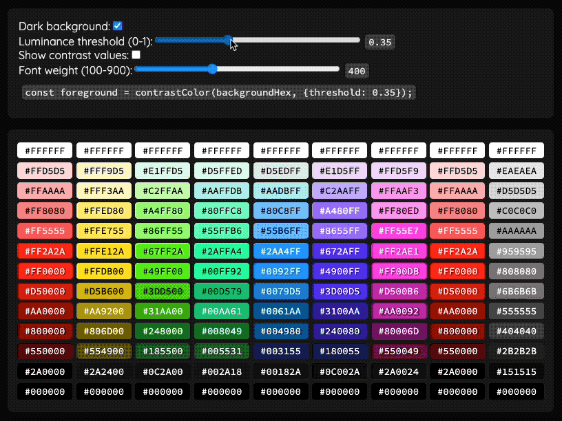

# counter-color

A set of methods for working with contrasting colors.

Use cases:

- Get contrasting text color for a given background
- Pick color from the list that has most contrast with a target color
- Get color relative luminance
- Get contrast difference between two colors
- Get contrast ratio between two colors
- Check if two colors have sufficient contrast difference

TypeScript Docs: https://n1kk.github.io/counter-color/

Demo page: https://n1kk.github.io/counter-color/demo.html



## Usage

Install:

```bash
# npm
npm i counter-color
# yarn
yarn add counter-color
# pnpm
pnpm i counter-color
```

## API

### # `counterColor(targetColor, options?) => string`

Get a most contrasting color for a given one. Defaults are black and white.

- `targetColor`: [supported color value](#colorvalue)
- `options`: optional object that allows you to configure:
  - `light` color: string
  - `dark` color: string
  - luminosity `threshold`: number (0-1)
- _**returns**_: `string` of a color which has most contrast with the given background

```ts
import counterColor from "counter-color";

const textColor1 = counterColor("#00F"); // "#000000"
const textColor2 = counterColor("#0F0"); // "#FFFFFF"

const options = { dark: "#222", light: "#eee", threshold: 0.4 };
const textColor3 = counterColor("#f00", options); // "#eee"
```

#### ColorValue

- A supported color value:
  - int: `0 - 16777215`,
  - rgb array of int (0-255): `[255, 0, 0]`,
  - hex color in web or full format: `#RGB` | `#RRGGBB` | `#RRGGBBAA`

### # `colorsContrast(color1, color2) => number`

Calculates contrast difference of two colors.

- `color1`, `color2`: [supported color value](#colorvalue)
- _**returns**_: `number` 0-1
  - 0: no difference
  - 1: max contrast, black and white

```ts
const bnw = colorsContrast("#000", "#FFF"); // 1
const sameColor = colorsContrast("#000", "#000"); // 0
```

### # `colorsContrastRatio(color1, color2) => number`

Calculates color contrast ratio based on [W3C spec](https://www.w3.org/TR/UNDERSTANDING-WCAG20/visual-audio-contrast-contrast.html)

- `color1`, `color2`: [supported color value](#colorvalue)
- _**returns**_: `number` between 1 (1:1 ratio) and 0.476... (1:21 ratio),
  - 1:1 : no contrast, same color
  - 1:21 : max contrast, black and white

```ts
const bnw = colorsContrastRatio("#000", "#FFF"); // 1/21 (0.047..)
const sameColor = colorsContrastRatio("#000", "#000"); // 1
```

### # `colorsHaveSufficientContrast(color1, color2) => number`

Check if colors have suffiecient contrast ratio (7:1) as defined by [W3C spec](https://www.w3.org/TR/WCAG20-TECHS/G17.html)

- `color1`, `color2`: [supported color value](#colorvalue)
- _**returns**_: `boolean`

```ts
colorsHaveSufficientContrast("#000", "#FFF"); // true
colorsHaveSufficientContrast("#000", "#000"); // false
```

### # `pickMostContrast(colorList, target) => color`

Pick a color from the list that has the most contrast with the target.

- `color`: an array of [supported color values](#colorvalue)
- _**returns**_: value from the list

```ts
pickMostContrast(["#fff", "#f00", "#00f", "#000"], "#000"); // "#fff"
pickMostContrast(["#fff", "#f00", "#00f", "#000"], "#fff"); // "#000"
```

### # `colorLuminance(color) => number`

Calculates relative color luminance as per [W3C spec](https://www.w3.org/WAI/GL/wiki/Relative_luminance)

- `color`: [supported color value](#colorvalue)
- _**returns**_: `number` 0-1

```ts
colorLuminance("#fff"); // 1
colorLuminance("#000"); // 0
colorLuminance("#F00"); // 0.21...
```

## Utils

### # `hexToRGB(hex) => [r, g, b]`

Convert a hex color to rgb array.

- `hex`: hex color value `#RGB` | `#RRGGBB` | `#RRGGBBAA`
- _**returns**_: rgb array

```ts
hexToRGB("#fff"); // [255, 255, 255]
```

### # `decToRGB(dec) => [r, g, b]`

Convert a dec color to rgb array.

- `dec`: integer from 0 to 16777215
- _**returns**_: rgb array

```ts
decToRGB(16777215); // [255, 255, 255]
```

### # `toRGB(color) => [r, g, b]`

Convert a [color values](#colorvalue) to rgb array. Throws on invalid input.

- `color`: [color values](#colorvalue)
- _**returns**_: rgb array

```ts
toRGB("#fff"); // [255, 255, 255]
toRGB(16777215); // [255, 255, 255]
```
